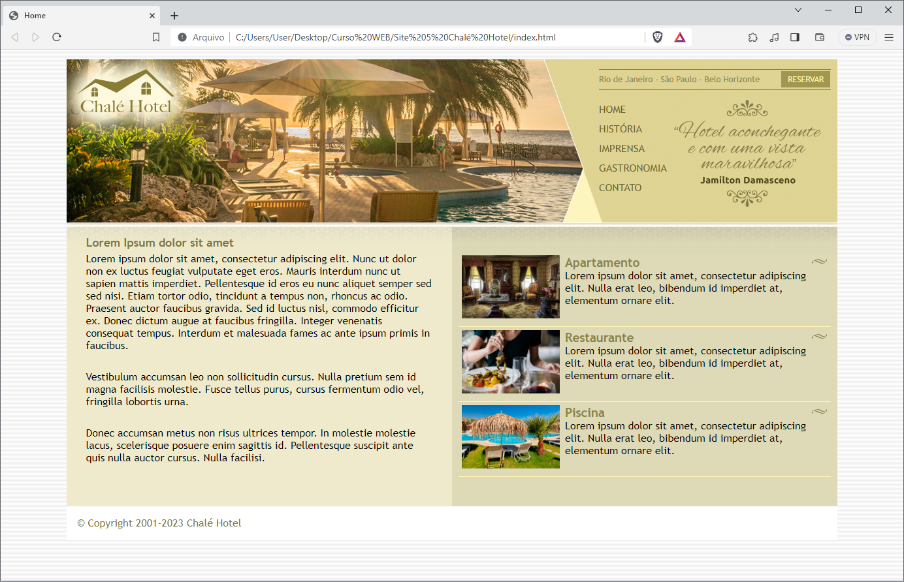

# Home-Site-Chale-Hotel
Seguindo o curso de desenvolvimento web que estou realizando esta é uma das páginas home que eu repliquei. Nela foi utilizado HTML e CSS aplicando conceitos de imagem, sobreposição, links, backgrounds, entre outros. Nessa home em específico utilizei principalmente conceitos de imagens e layout líquidos.

Home:

Home diminuída em tamanho:

